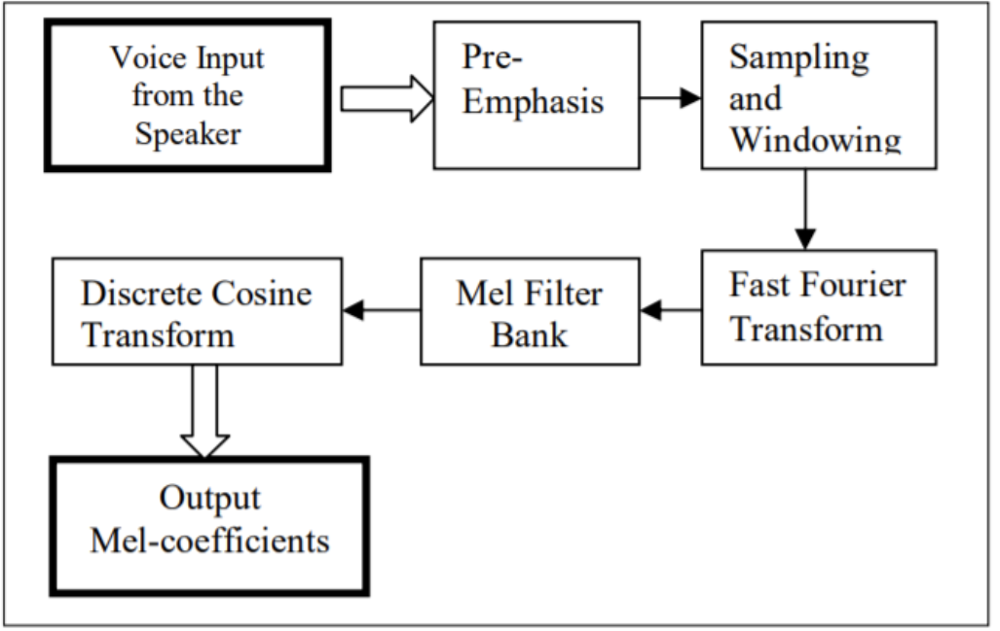
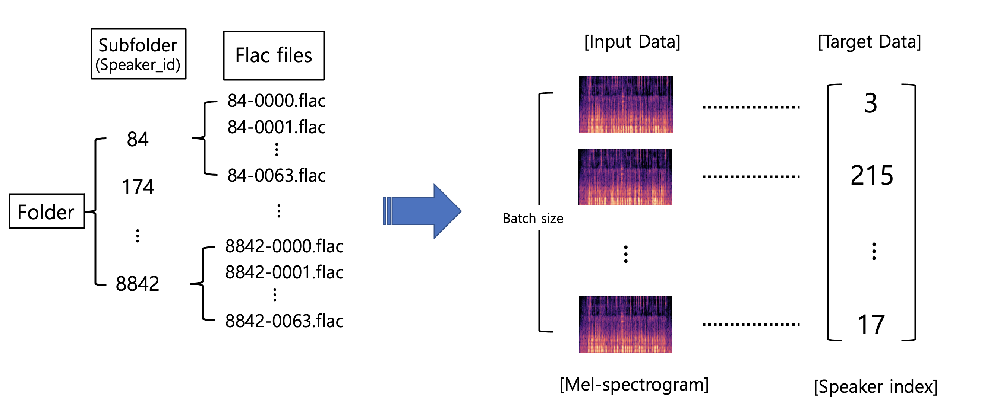

# Speech_Preprocessing

## Whole process of speech signal processing (Mel-spectrogram &amp; MFCCs) 

### Data

#### .wav file

## Process of loading data using Dataset and Dataloader

### Data
#### [LibriSpeech](http://www.openslr.org/12/)

## References

https://haythamfayek.com/2016/04/21/speech-processing-for-machine-learning.html
